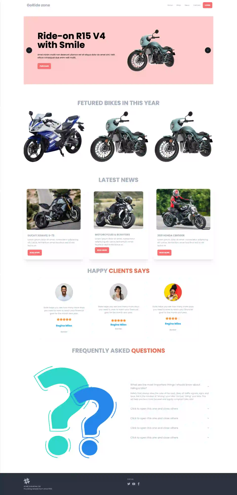

# Exploring tailwind and daisyui

# Learing Objects:

**Learning Objective:**

By the end of this project, I aim to gain a comprehensive understanding of Tailwind CSS and DaisyUI, focusing on their core concepts, features, and practical application.

**Key Learning Goals:**

1. **Mastering Tailwind CSS:** I intend to become proficient in using Tailwind CSS for efficient and rapid web development. This includes understanding the utility-first approach, responsive design principles, and customization options.

2. **Exploring DaisyUI:** I aim to explore and implement the features offered by DaisyUI, such as its collection of UI components, form elements, and plugins. I will learn how to integrate DaisyUI seamlessly into Tailwind CSS projects.

3. **Efficient Styling:** I will learn how to leverage Tailwind CSS to create clean and maintainable styles for web applications, reducing the need for custom CSS.

4. **Responsive Design:** I plan to grasp the techniques required to make web applications responsive across various devices using Tailwind CSS and DaisyUI.

5. **Optimizing Workflow:** I intend to discover how to streamline my web development workflow by harnessing the power of Tailwind CSS and DaisyUI's utility classes and components.

6. **Project Application:** To demonstrate my learning, I will complete a practical project that involves building a responsive web application using Tailwind CSS and DaisyUI.

This learning objective aims to equip me with the skills and knowledge needed to efficiently design and develop web applications using these two powerful front-end tools, ultimately enhancing my web development capabilities.

# Here is the output layout || Live Link -- <a href="https://the-mihir.github.io/biker-zone/"> Clik Here to see the Live page </a>

